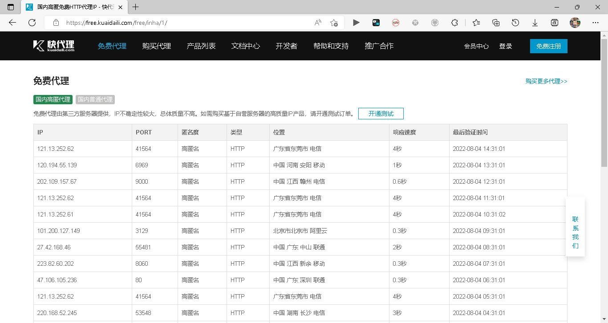
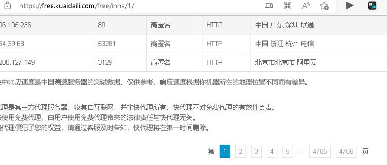
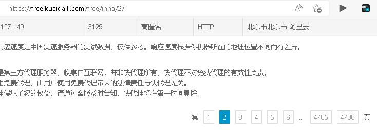
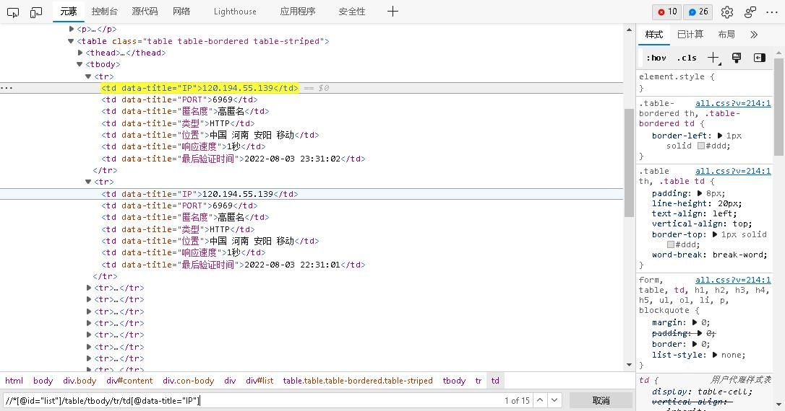
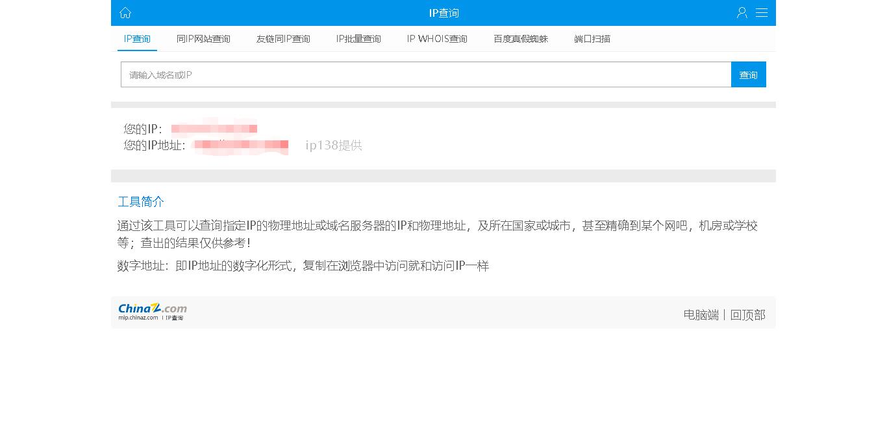
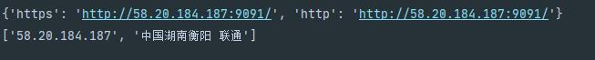

# ip代理池制作
[个人博客](https://blog.csdn.net/weixin_46598546)

## 一.依赖库

### `pip install -r requirement.txt`


## 二.过程

### 1.ip代理网页

在网上随便找一个[代理ip](https://free.kuaidaili.com/free/inha/1/)，如图

<div align=center></div>

### 2.网站分析

通过不断切换页面，观察网址（又叫 url/uri）的变化

<div align=center></div>

<div align=center></div>

可以看出变化的部分是 "{}" 部分 `https://free.kuaidaili.com/free/inha/{}/`

以此，可以迭代出全部页面。

代码块：

```python
import requests
# range(a, b)：从a开始，在b前停止
for i in range(1, 4707):
    # str 进行格式转换
    url = f'https://free.kuaidaili.com/free/inha/{str(i)}/'
    # 加入UA防止反爬
    headers = {
        'User-agent': 'Mozilla/5.0 (Windows NT 10.0; WOW64) '
                      'AppleWebKit/537.36 (KHTML, like Gecko) Chrome/63.0.3239.132 Safari/537.36'
    }
    response = requests.get(url, headers = headers).text
```

### 3.信息提取
通过右键=>复制=>复制 `xpath`，再手动修改得到 `//*[@id="list"]/table/tbody/tr/td[@data-title="IP"]/text()`这样就得到了ip的xpath
同理可得：port的xpath `//*[@id="list"]/table/tbody/tr/td[@data-title="PORT"]/text()`
同理可得：类型的xpath `//*[@id="list"]/table/tbody/tr/td[@data-title="类型"]/text()`

<div align=center></div>


```python
import requests
import parsel


def getIp():
    for i in range(1, 4707):
        url = f'https://free.kuaidaili.com/free/inha/{str(i)}/'
        headers = {
            'User-agent': 'Mozilla/5.0 (Windows NT 10.0; WOW64) '
                          'AppleWebKit/537.36 (KHTML, like Gecko) Chrome/63.0.3239.132 Safari/537.36'
        }
        response = requests.get(url, headers = headers).text
        selector = parsel.Selector(response)
        ip = selector.xpath('//*[@id="list"]/table/tbody/tr/td[@data-title="IP"]/text()').getall()
        port = selector.xpath('//*[@id="list"]/table/tbody/tr/td[@data-title="PORT"]/text()').getall()
        print(ip, port)


getIp()
```

#### 报错与修改
以上代码如果说直接运行的话，会报错
```shell script
Traceback (most recent call last):
  File "E:/韩京运/hjy/hjy/编程/Python/爬虫/ip池/ip-proxy-By-hjy/代理ip.py", line 20, in <module>
    getIp()
  File "E:/韩京运/hjy/hjy/编程/Python/爬虫/ip池/ip-proxy-By-hjy/代理ip.py", line 13, in getIp
    response = requests.get(url, headers = headers).text
  File "E:\python\Anaconda3\Lib\site-packages\requests\api.py", line 76, in get
    return request('get', url, params=params, **kwargs)
  File "E:\python\Anaconda3\Lib\site-packages\requests\api.py", line 61, in request
    return session.request(method=method, url=url, **kwargs)
  File "E:\python\Anaconda3\Lib\site-packages\requests\sessions.py", line 542, in request
    resp = self.send(prep, **send_kwargs)
  File "E:\python\Anaconda3\Lib\site-packages\requests\sessions.py", line 677, in send
    history = [resp for resp in gen]
  File "E:\python\Anaconda3\Lib\site-packages\requests\sessions.py", line 677, in <listcomp>
    history = [resp for resp in gen]
  File "E:\python\Anaconda3\Lib\site-packages\requests\sessions.py", line 166, in resolve_redirects
    raise TooManyRedirects('Exceeded {} redirects.'.format(self.max_redirects), response=resp)
requests.exceptions.TooManyRedirects: Exceeded 30 redirects.
```
`requests.exceptions.TooManyRedirects: Exceeded 30 redirects.`翻译过来就是 `超过 30 个重定向` 是网站的一种反爬机制，加上延时就行了
```python
import requests
import parsel
from time import sleep


def getIp():
    for i in range(1, 4707):
        url = f'https://free.kuaidaili.com/free/inha/{str(i)}/'
        headers = {
            'User-agent': 'Mozilla/5.0 (Windows NT 10.0; WOW64) '
                          'AppleWebKit/537.36 (KHTML, like Gecko) Chrome/63.0.3239.132 Safari/537.36'
        }
        response = requests.get(url, headers = headers).text
        selector = parsel.Selector(response)
        ip = selector.xpath('//*[@id="list"]/table/tbody/tr/td[@data-title="IP"]/text()').getall()
        port = selector.xpath('//*[@id="list"]/table/tbody/tr/td[@data-title="PORT"]/text()').getall()
        print(ip, port)
        # 经过测试，最短间隔时间是0.5s
        sleep(0.5)


getIp()
```

### 4.检查
[ip地址查询网站](http://dev.kdlapi.com/testproxy)

<div align=center></div>

通过爬虫，检查是否为代理ip

```python
def check(ip, port):
    for i in range(0, len(ip)):
        proxies = {
            'https': f'http://{ip[i]}:{port[i]}/',
            'http': f'http://{ip[i]}:{port[i]}/'
        }
        print(proxies)

        try:
            response = re.findall(r'<span class="c-red">(.*?)</span>',
                                  requests.get('http://mip.chinaz.com', proxies = proxies, timeout = 1.5).text)

            if len(response) == 2:
                print('Success!')
        except requests.exceptions.ProxyError:
            print('pass')
        except requests.exceptions.ReadTimeout:
            print('Error')
        except requests.exceptions.ConnectTimeout:
            print('Error')
```
测试成功截图

<div align=center></div>


## 三.再做一点点完善
```python
import re

import parsel
import requests

list_ = set(())


def getIp():
    global list_
    for i in range(1, 4707):
        url = f'https://free.kuaidaili.com/free/inha/{str(i)}/'
        headers = {
            'User-agent': 'Mozilla/5.0 (Windows NT 10.0; WOW64) '
                          'AppleWebKit/537.36 (KHTML, like Gecko) Chrome/63.0.3239.132 Safari/537.36'
        }
        response = requests.get(url, headers = headers).text
        selector = parsel.Selector(response)
        ip = selector.xpath('//*[@id="list"]/table/tbody/tr/td[@data-title="IP"]/text()').getall()
        port = selector.xpath('//*[@id="list"]/table/tbody/tr/td[@data-title="PORT"]/text()').getall()
        print(ip, port)
        check(ip, port)
        print(list_)
        with open('./ip.txt', 'w') as f:
            for j in list_:
                print(j)
                f.writelines(j)


def check(ip, port):
    for i in range(0, len(ip)):
        proxies = {
            'https': f'http://{ip[i]}:{port[i]}/',
            'http': f'http://{ip[i]}:{port[i]}/'
        }
        # print(proxies)

        try:
            
            response = re.findall(r'<span class="c-red">(.*?)</span>',
                                  requests.get('http://mip.chinaz.com', proxies = proxies, timeout = 1.5).text)
            if len(response) == 2:
                with open('ip.txt', 'r') as r:
                    for line in r.readlines():
                        list_.add(line)
                list_.add(str(proxies) + '\n')
                # print(list_)
                for abc in list_:
                    # print(abc)
                    pass
                print(response)
        except:
            pass


getIp()
```
# 感谢观看
<div align=center></div>
